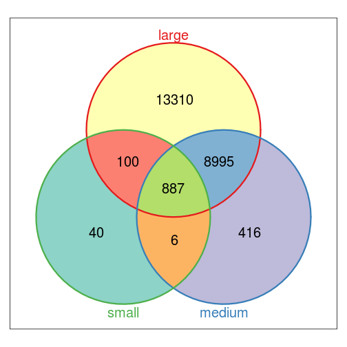
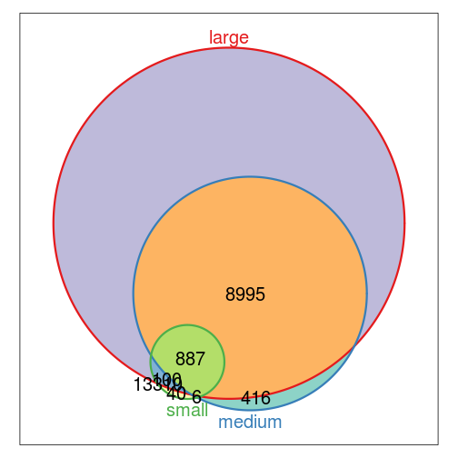

# Example of how to use makeVenn.R {WIP}

## Intro

I created these function due to frustration with how slow the ChIPseqAnno package was and 
the perceived lack of utilities for making good venn diagrams with GRanges and cut out overlaps of these venn diagrams.

I am using this mostly for chip-seq data but I would imagine this could be used for any Genomic ranges based data.

This document is still a work in progress is currently only a brief outline of functions and an example.

## Functions

*peak2GRanges*(bedfile, type="macs", skip=0)
INCOMPLETE. The goal of this function is to convert peak caller output to GRanges
- bedfile is the name file that is peak caller output (typically a bed file)

*createResultMatrix*(typ, fo)
Generate a 'result matrix' (required for every venn diagram)
- results matrix has n columns where n is the number of sets being compared and nrow(fo) rows
- typ is a vector differentiating between the different GRanges
- fo is result of `findOverlaps()` function in IRanges package

*extractOverlap*(..., res, typ)
Given res and typ, it will return a true/false vector indexed by whatever column name(s) it is passed in '...'

*printOverlap*(..., res, typ)
Print out the overlaps in a compressed way, need to explain this better when I remember what I did.

*readinGRanges*(...)
Put a bunch of GRanges in, returns result and type matrix `c(res, typ)`

*createOverlapMatrix*(res, typ) 
This function will create an overlap matrix. An overlap matrix is a human readable matrix that enumerates 
all possible overlaps. See source for more details and examples.

*createVenn*(res, typ, overlap = NA, doWeights = FALSE, ...)
Create venn diagram using Vennerable library (can draw up to 5-way venn diagrams (If there are libraries that draw better
I would be happy to stick it in).

*makeVennRunall*(...)
Put in GRanges, get a venn diagram (type and result matrix are returned invisibily)

*makeVennExample*()
INCOMPLETE This example only works if you have 3 bed files named `high1_peaks.bed` `high2_peaks.bed` and `high_peaks.bed` 
in the current directory with score in the 5th column.

## Example

Make a venn diagram from 3 GRanges objects named small/medium/large (in the future `peak2GRanges()` will take over this step)


```r
source("makeVenn.R")

# tmpbed = read.table('small.narrowPeak') tmpgrg = GRanges(seqnames =
# Rle(tmpbed[,1]), ranges = IRanges(start=as.numeric(tmpbed[,2]),
# end=as.numeric(tmpbed[,3]), names=tmpbed[,4]), score=tmpbed[,9]) small =
# tmpgrg tmpbed = read.table('medium.narrowPeak') tmpgrg =
# GRanges(seqnames = Rle(tmpbed[,1]), ranges =
# IRanges(start=as.numeric(tmpbed[,2]), end=as.numeric(tmpbed[,3]),
# names=tmpbed[,4]), score=tmpbed[,9]) medium = tmpgrg tmpbed =
# read.table('large.narrowPeak') tmpgrg = GRanges(seqnames =
# Rle(tmpbed[,1]), ranges = IRanges(start=as.numeric(tmpbed[,2]),
# end=as.numeric(tmpbed[,3]), names=tmpbed[,4]), score=tmpbed[,9]) large =
# tmpgrg save(small, medium, large, file='makeVenn.rd')

load("makeVenn.rd")
```


You can then put it into `makeVennRunall(small, medium, large)` or go through each of the steps individually.

Don't use `readinGRanges()` since this function is not complete and might be changed later.

Quick run through: (`makeVennRunall()` will run these functions)

```r
glg = GRangesList(small, medium, large)  #GRanges list
typ = rep(as.character(substitute(list(small, medium, large)))[-1L], as.numeric(lapply(glg, 
    length)))
fo = findOverlaps(unlist(glg), ignoreSelf = T)  #find overlaps
res = createResultMatrix(typ, fo)  #results matrix
overlap = createOverlapMatrix(res, typ)
createVenn(res, typ, overlap)
```

 

```r
overlap
```

```
##        large medium small
## all      890    887   865
## large     81   8969    98
## medium  9021      4     6
## small    103      7     0
## unique 13310    416    40
```


Make weighted venn diagram. When the differences in intersections are so great, the venn digram does not look good weighted.

```r
createVenn(res, typ, overlap, weighted = TRUE)  #will print out overlap matrix
```

 


### Using makeVenn to cut out overlaps of interest
Isolate regions in `large` that overlap all regions

```r
# large must be specified first in extractOverlap
large_intersect_all = large[extractOverlap("large", "medium", "small", res = res, 
    typ = typ)]
length(large_intersect_all)
```

```
## [1] 890
```

```r
head(large_intersect_all)
```

```
## GRanges with 6 ranges and 1 metadata column:
##     seqnames                 ranges strand |            score
##        <Rle>              <IRanges>  <Rle> |        <numeric>
##   .     chr5 [159247124, 159247479]      * | 4.12205196263325
##   .    chr10 [ 74008476,  74008936]      * | 4.12205196263325
##   .    chr17 [ 57902860,  57903277]      * | 4.12205196263325
##   .     chr2 [101736958, 101737460]      * | 4.12205196263325
##   .    chr12 [ 52625529,  52625906]      * | 4.12205196263325
##   .     chr5 [172296068, 172296532]      * | 4.12205196263325
##   ---
##   seqlengths:
##     chr1 chr10 chr11 chr12 chr13 chr14 ...  chr7  chr8  chr9  chrX  chrY
##       NA    NA    NA    NA    NA    NA ...    NA    NA    NA    NA    NA
```


Isolate regions that are unique to `medium`

```r
medium_unique = medium[extractOverlap("medium", res = res, typ = typ)]
length(medium_unique)
```

```
## [1] 416
```

```r
head(medium_unique)
```

```
## GRanges with 6 ranges and 1 metadata column:
##     seqnames               ranges strand |            score
##        <Rle>            <IRanges>  <Rle> |        <numeric>
##   .    chr19 [39174799, 39174872]      * | 3.53617953213724
##   .    chr15 [59492386, 59492538]      * | 3.53617953213724
##   .    chr14 [51471910, 51472010]      * | 2.93459943821543
##   .    chr20 [48922435, 48922719]      * |  2.6998377258693
##   .    chr11 [29141291, 29141575]      * |  2.6268875962802
##   .    chr11 [66654038, 66654322]      * | 2.54203878013516
##   ---
##   seqlengths:
##     chr1 chr10 chr11 chr12 chr13 chr14 ...  chr7  chr8  chr9  chrX  chrY
##       NA    NA    NA    NA    NA    NA ...    NA    NA    NA    NA    NA
```


Isolate regions that are self overlaps in `medium`

```r
medium_self_overlap = medium[extractOverlap("medium", "medium", res = res, typ = typ)]
length(medium_self_overlap)
```

```
## [1] 4
```

```r
head(medium_self_overlap)
```

```
## GRanges with 4 ranges and 1 metadata column:
##     seqnames                 ranges strand |             score
##        <Rle>              <IRanges>  <Rle> |         <numeric>
##   .     chr8 [  8521987,   8522271]      * |  1.80817124057177
##   .     chr7 [130538426, 130538710]      * |  1.03774313022021
##   .    chr12 [ 92996740,  92997024]      * | 0.981889396176367
##   .    chr18 [  3711022,   3711306]      * | 0.963924634554715
##   ---
##   seqlengths:
##     chr1 chr10 chr11 chr12 chr13 chr14 ...  chr7  chr8  chr9  chrX  chrY
##       NA    NA    NA    NA    NA    NA ...    NA    NA    NA    NA    NA
```

```r

medium_fo = findOverlaps(medium_self_overlap, medium)
head(medium_fo, n = 8)
```

```
## Hits of length 8
## queryLength: 4
## subjectLength: 10279
##   queryHits subjectHits 
##    <integer>   <integer> 
##  1         1        4919 
##  2         1        8285 
##  3         2        9124 
##  4         2        9472 
##  5         3        4276 
##  6         3        9659 
##  7         4        2469 
##  8         4        9837
```

```r
head(medium[subjectHits(medium_fo)], n = 8)
```

```
## GRanges with 8 ranges and 1 metadata column:
##     seqnames                 ranges strand |             score
##        <Rle>              <IRanges>  <Rle> |         <numeric>
##   .     chr8 [  8521987,   8522271]      * |  1.80817124057177
##   .     chr8 [  8522198,   8522482]      * |  1.13692241645281
##   .     chr7 [130538426, 130538710]      * |  1.03774313022021
##   .     chr7 [130538674, 130538958]      * | 0.999610631717568
##   .    chr12 [ 92996540,  92996824]      * |  2.04552618126134
##   .    chr12 [ 92996740,  92997024]      * | 0.981889396176367
##   .    chr18 [  3710822,   3711106]      * |  2.99449312288085
##   .    chr18 [  3711022,   3711306]      * | 0.963924634554715
##   ---
##   seqlengths:
##     chr1 chr10 chr11 chr12 chr13 chr14 ...  chr7  chr8  chr9  chrX  chrY
##       NA    NA    NA    NA    NA    NA ...    NA    NA    NA    NA    NA
```


## Additional info
Output from each step:

```r
head(small)
```

```
## GRanges with 6 ranges and 1 metadata column:
##     seqnames                 ranges strand |            score
##        <Rle>              <IRanges>  <Rle> |        <numeric>
##   .    chr17 [  8057661,   8057930]      * | 2.29885307640994
##   .     chr5 [172296142, 172296382]      * | 2.29885307640994
##   .     chr5 [133802146, 133802339]      * | 2.29885307640994
##   .     chr6 [ 26285669,  26285953]      * | 2.29885307640994
##   .     chr3 [188665820, 188666023]      * | 2.29885307640994
##   .     chr6 [ 26189252,  26189536]      * | 2.29885307640994
##   ---
##   seqlengths:
##     chr1 chr10 chr11 chr12 chr13 chr14 ...  chr6  chr7  chr8  chr9  chrX
##       NA    NA    NA    NA    NA    NA ...    NA    NA    NA    NA    NA
```

```r
length(small)
```

```
## [1] 1009
```

```r
head(medium)
```

```
## GRanges with 6 ranges and 1 metadata column:
##     seqnames                 ranges strand |            score
##        <Rle>              <IRanges>  <Rle> |        <numeric>
##   .    chr17 [ 57902900,  57903239]      * | 3.53617953213724
##   .     chr5 [159247148, 159247438]      * | 3.53617953213724
##   .    chr10 [ 74008539,  74008891]      * | 3.53617953213724
##   .     chr5 [172296109, 172296456]      * | 3.53617953213724
##   .    chr20 [ 45962885,  45963193]      * | 3.53617953213724
##   .     chr8 [129169584, 129169867]      * | 3.53617953213724
##   ---
##   seqlengths:
##     chr1 chr10 chr11 chr12 chr13 chr14 ...  chr7  chr8  chr9  chrX  chrY
##       NA    NA    NA    NA    NA    NA ...    NA    NA    NA    NA    NA
```

```r
length(medium)
```

```
## [1] 10279
```

```r
head(large)
```

```
## GRanges with 6 ranges and 1 metadata column:
##     seqnames                 ranges strand |            score
##        <Rle>              <IRanges>  <Rle> |        <numeric>
##   .     chr5 [159247124, 159247479]      * | 4.12205196263325
##   .    chr10 [ 74008476,  74008936]      * | 4.12205196263325
##   .    chr17 [ 57902860,  57903277]      * | 4.12205196263325
##   .     chr1 [  8250012,   8250391]      * | 4.12205196263325
##   .     chr2 [101736958, 101737460]      * | 4.12205196263325
##   .    chr12 [ 52625529,  52625906]      * | 4.12205196263325
##   ---
##   seqlengths:
##     chr1 chr10 chr11 chr12 chr13 chr14 ...  chr7  chr8  chr9  chrX  chrY
##       NA    NA    NA    NA    NA    NA ...    NA    NA    NA    NA    NA
```

```r
length(large)
```

```
## [1] 23324
```

```r

head(typ)
```

```
## [1] "small" "small" "small" "small" "small" "small"
```

```r
length(typ)
```

```
## [1] 34612
```

```r
table(typ)
```

```
## typ
##  large medium  small 
##  23324  10279   1009
```

```r
head(fo)  #special class
```

```
## Hits of length 6
## queryLength: 34612
## subjectLength: 34612
##   queryHits subjectHits 
##    <integer>   <integer> 
##  1         1        1048 
##  2         1       11360 
##  3         2        1013 
##  4         2       11295 
##  5         3        1070 
##  6         3       11316
```

```r
nrow(as.matrix(fo))
```

```
## [1] 24180
```

```r
head(res)
```

```
##      large medium small
## [1,]     1      1     0
## [2,]     1      1     0
## [3,]     1      1     0
## [4,]     1      1     0
## [5,]     1      1     0
## [6,]     1      1     0
```

```r
dim(res)
```

```
## [1] 34612     3
```

```r

sessionInfo()
```

```
## R version 2.15.3 (2013-03-01)
## Platform: x86_64-pc-linux-gnu (64-bit)
## 
## locale:
##  [1] LC_CTYPE=en_US.utf8       LC_NUMERIC=C             
##  [3] LC_TIME=en_US.utf8        LC_COLLATE=en_US.utf8    
##  [5] LC_MONETARY=en_US.utf8    LC_MESSAGES=en_US.utf8   
##  [7] LC_PAPER=C                LC_NAME=C                
##  [9] LC_ADDRESS=C              LC_TELEPHONE=C           
## [11] LC_MEASUREMENT=en_US.utf8 LC_IDENTIFICATION=C      
## 
## attached base packages:
## [1] grid      stats     graphics  grDevices utils     datasets  methods  
## [8] base     
## 
## other attached packages:
##  [1] Vennerable_2.2       xtable_1.7-1         gtools_2.7.1        
##  [4] reshape_0.8.4        plyr_1.8             RColorBrewer_1.0-5  
##  [7] lattice_0.20-15      RBGL_1.34.0          graph_1.36.2        
## [10] GenomicRanges_1.10.7 IRanges_1.16.6       BiocGenerics_0.4.0  
## [13] knitr_1.2           
## 
## loaded via a namespace (and not attached):
## [1] digest_0.6.3    evaluate_0.4.4  formatR_0.8     parallel_2.15.3
## [5] stats4_2.15.3   stringr_0.6.2   tcltk_2.15.3    tools_2.15.3
```

Note to self: I followed the example shown here: https://github.com/yihui/knitr-examples
